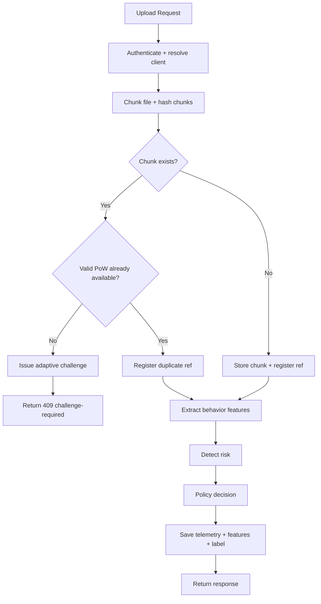

# Team 44 - Second Review Report (Markdown Draft)

## 1. Project Modules and Descriptions

| Module | Status | Description | Main Files / Planned Endpoints |
|---|---|---|---|
| API Orchestration + Security | Completed | Handles `/upload`, `/pow/challenge`, `/pow/verify`, API-key validation, and stable client identity. | `app.py`, `auth.py` |
| Deduplication + Storage | Completed | Splits file into chunks, hashes chunks, checks duplicate existence, stores only new chunks, and increments reference count for duplicates. | `chunking.py`, `hashing.py`, `dedup_index.py`, `storage.py` |
| Adaptive PoW + Reputation | Completed | Enforces proof-of-ownership for duplicates and adapts challenge difficulty using risk, reputation, and duplicate pressure. | `pow.py`, `pow_session.py`, `adaptive_pow.py`, `reputation.py` |
| Behavioral Detection + Policy | Completed | Extracts request behavior features, performs anomaly/attack detection (supervised or unsupervised), and maps risk to `ALLOW` / `RATE_LIMIT` / `BLOCK`. | `features.py`, `detector.py`, `policy_engine.py` |
| Telemetry + Training/Evaluation | Completed | Logs events and features, stores labeled results, trains models, and generates evaluation reports. | `logger.py`, `feature_store.py`, `train_model.py`, `evaluate_model.py` |
| Cloud Auditing Module | Next to implement | Adds challenge-response integrity audit over stored chunks and persistent audit evidence. | Planned: `POST /audit/challenge`, `POST /audit/verify` |
| Ownership + Data Dynamics Module | Next to implement | Adds ownership lifecycle (`grant/revoke/transfer`) and file-recipe update/delete/version support. | Planned: ownership event store + recipe version operations |

---

## 2. Architectural Diagram (Updated)

```mermaid
flowchart LR
    A[Client] --> B[FastAPI Service]
    B --> C[Auth + Client ID]
    B --> D[Chunking + SHA-256 Hashing]
    D --> E[Dedup Index]

    E -->|New chunk| F[Chunk Storage]
    E -->|Duplicate| G[Adaptive PoW]
    G --> H[PoW Verify]
    H -->|Pass| E
    H -->|Fail| X[Reject 403/409]

    B --> I[Telemetry Logger]
    I --> J[Feature Extraction]
    J --> K[Detector]
    K -->|Supervised| K1[Attack Classifier]
    K -->|Unsupervised| K2[IF + OCSVM (+ optional AE/LSTM)]
    K --> L[Policy Engine]
    L --> M[ALLOW / RATE_LIMIT / BLOCK]
    L --> N[Reputation Update]
```

---

## 3. Algorithm Flow Diagram



---

## 4. Working Pseudocode of Proposed Algorithm / Mechanism

```text
Algorithm: Secure Deduplication with Behavioral Monitoring
Input: file, client_id
Output: {status, file_recipe, anomaly_result, policy_decision}

function HANDLE_UPLOAD(file, client_id):
    validate_api_key_and_client(client_id)
    enforce_active_policy_if_any(client_id)

    chunks  <- chunk_file(file)
    hashes  <- [SHA256(chunk) for chunk in chunks]
    context <- compute_adaptive_inputs(client_id)  # risk + reputation

    # Phase 1: enforce PoW for duplicates
    for each (chunk, h) in (chunks, hashes):
        if chunk_exists(h):
            if not verify_or_consume_pow(client_id, h):
                challenge <- get_or_create_challenge(client_id, h, len(chunk), context)
                return HTTP_409(challenge_required = challenge)

    # Phase 2: dedup store/update
    for each (chunk, h) in (chunks, hashes):
        if not chunk_exists(h):
            upload_chunk(h, chunk)
        register_chunk(h)

    # Phase 3: behavior detection + policy
    features <- extract_features(client_history)
    if supervised_artifacts_available():
        detection <- supervised_detect(features)
    else:
        detection <- unsupervised_detect(features)

    policy <- decide_response(detection.risk_score)
    update_reputation(client_id, policy, pow_results)
    save_features_and_labels(client_id, features, detection, policy)

    return HTTP_200(success_payload)
```

---

## 5. Completed Modules with Implementation Details and Results

### 5.1 Detection Module (Supervised)
- Implementation:
  - Label-aware classifier pipeline trained from `demo_detection_results.csv`.
  - Best selected model in `advanced_artifacts`: `random_forest` with CV macro-F1 `0.9484`.
- Results (`advanced_artifacts/evaluation_report.md`):
  - PR-AUC: `1.000000`
  - F1 (binary): `0.994152`
  - F1 (macro): `0.982790`
  - Precision: `1.000000`
  - Recall: `0.988372`
  - Confusion matrix (normal vs anomaly): TN=17, FP=0, FN=1, TP=85
  - Multiclass macro-F1: `0.976190`

### 5.2 Detection Module (Unsupervised)
- Implementation:
  - Ensemble in unsupervised mode (`unsupervised_artifacts`) with IsolationForest + OneClassSVM.
  - Optional dense/LSTM autoencoder artifacts are available in the same model directory.
  - Decision threshold: `risk_score >= 0.50`.
- Results (`unsupervised_artifacts/evaluation_report.md`):
  - PR-AUC: `0.855618`
  - F1 (binary): `0.130435`
  - F1 (macro): `0.214340`
  - Precision: `1.000000`
  - Recall: `0.069767`
  - Confusion matrix (normal vs anomaly): TN=17, FP=0, FN=80, TP=6
  - Multiclass metrics: not applicable in unsupervised mode

### 5.3 Adaptive PoW + Reputation Module
- Implementation:
  - Duplicate requests require PoW verification (`/pow/challenge`, `/pow/verify`).
  - Difficulty is adapted from risk, reputation, and duplicate pressure.
- Results (`pow_comparison_summary.json`):
  - Static baseline proof length: `32`
  - Adaptive mean proof length (all): `94.8349`
  - Adaptive mean proof length (normal): `50.5882`
  - Adaptive mean proof length (anomaly): `103.5814`
  - Estimated attacker success on anomaly rows:
    - Static: `1.0000`
    - Adaptive: `0.4735`
    - Relative reduction: `52.6514%`
  - Benign overhead: `58.0882%`

### 5.4 Deduplication + Storage Module
- Implementation:
  - Chunking + SHA-256 chunk fingerprinting.
  - Duplicate check through dedup index with ref-count updates.
  - Storage backend abstraction (S3/MinIO/local fallback).
- Result:
  - End-to-end dedup upload path is integrated with PoW enforcement and detection policy.

### 5.5 Telemetry + Feature Pipeline
- Implementation:
  - Request events persisted to `request_logs.csv` + SQLite (`telemetry.db`).
  - Feature snapshots persisted to `detection_results.csv` + SQLite.
  - Runtime features include rate, duplicate behavior, burst behavior, and cross-user hash overlap.
- Dataset used in current evaluation:
  - `demo_detection_results.csv` rows: `103`
  - Label distribution: normal=17, anomalies=86 (ownership_fraud=60, hash_probing=18, dedup_dos=8)

### 5.6 Next Modules to Implement
- Cloud Auditing Module:
  - Add stored-chunk integrity auditing workflow with challenge/verify endpoints.
  - Planned endpoints: `POST /audit/challenge`, `POST /audit/verify`.
- Ownership + Data Dynamics Module:
  - Add ownership event lifecycle: `grant`, `revoke`, `transfer`.
  - Add file-recipe versioning and update/delete support.

---

## 6. Evaluation Metrics and Formulas

### 6.1 Classification Metrics

Let:
- `TP` = true positives
- `TN` = true negatives
- `FP` = false positives
- `FN` = false negatives

Formulas:
- `Accuracy = (TP + TN) / (TP + TN + FP + FN)`
- `Precision = TP / (TP + FP)`
- `Recall = TP / (TP + FN)`
- `F1 = 2 * (Precision * Recall) / (Precision + Recall)`
- `Macro-F1 = (1/C) * sum(F1_i)` for `C` classes
- `Weighted-F1 = sum(support_i * F1_i) / sum(support_i)`
- `PR-AUC = area under Precision-Recall curve`

### 6.2 Unsupervised Risk Aggregation (Implemented)

In `detector.py`:
- `risk_score = (sum(w_m * I_m)) / (sum(w_m))`
- `I_m in {0,1}` is anomaly flag from model `m`
- Default weights:
  - IsolationForest: `0.25`
  - OneClassSVM: `0.20`
  - Dense Autoencoder: `0.25`
  - LSTM Autoencoder: `0.30`

Decision rule:
- `is_anomaly = (risk_score >= unsupervised_threshold)`
- Current threshold: `0.50`

### 6.3 Adaptive PoW Formulas (Implemented)

Difficulty:
- `difficulty_score = clamp(0.65*risk + 0.25*(1 - reputation) + 0.10*duplicate_pressure)`

Challenge length:
- `challenge_length = base_length + round(extra_room * difficulty_score)`

Security improvement:
- `AttackerSuccessReduction(%) = ((baseline_success - adaptive_success) / baseline_success) * 100`

### 6.4 Deduplication and Overhead Metrics

- `DuplicateRatio = duplicate_requests / total_requests`
- `StorageReductionRatio = (logical_size - physical_size) / logical_size`
- `DedupRatio = logical_size / physical_size`
- `Throughput = processed_chunks / time_seconds`
- `Latency(operation) = end_time - start_time`

---

## 7. Summary Table (Include in Report)

| Category | Supervised | Unsupervised |
|---|---:|---:|
| PR-AUC | 1.0000 | 0.8556 |
| F1 (binary) | 0.9942 | 0.1304 |
| Precision | 1.0000 | 1.0000 |
| Recall | 0.9884 | 0.0698 |
| TN / FP / FN / TP | 17 / 0 / 1 / 85 | 17 / 0 / 80 / 6 |
| Multiclass Macro-F1 | 0.9762 | N/A |

Adaptive PoW (comparison summary):
- Baseline attacker success: `1.0000`
- Adaptive attacker success: `0.4735`
- Reduction: `52.6514%`
- Benign overhead: `58.0882%`

---

## 8. Artifact Sources

- `advanced_artifacts/evaluation_report.md`
- `advanced_artifacts/training_metrics.json`
- `unsupervised_artifacts/evaluation_report.md`
- `unsupervised_artifacts/evaluation_report.json`
- `pow_comparison_summary.json`
- `PROGRESS_60.md`
- `app.py`, `detector.py`, `policy_engine.py`, `adaptive_pow.py`
