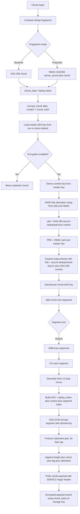
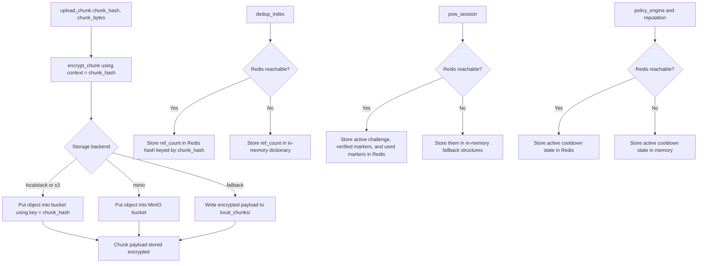
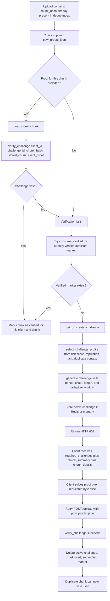
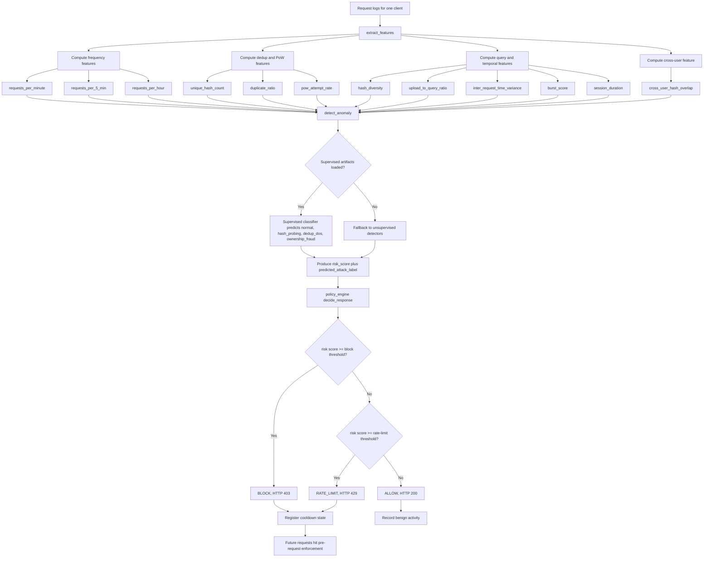

# Detailed Flowchart

This document shows the actual runtime flow of the current prototype:

- file upload and chunking,
- dedup fingerprint generation,
- fingerprint-bound encryption,
- storage and dedup index updates,
- duplicate handling with PoW,
- behavioural detection and policy response,
- and the LocalStack / Redis backing services.

These diagrams are based on the current code in:

- [app.py](/e:/secure-dedup/app.py)
- [chunking.py](/e:/secure-dedup/chunking.py)
- [hashing.py](/e:/secure-dedup/hashing.py)
- [encryption.py](/e:/secure-dedup/encryption.py)
- [storage.py](/e:/secure-dedup/storage.py)
- [pow_session.py](/e:/secure-dedup/pow_session.py)
- [features.py](/e:/secure-dedup/features.py)
- [detector.py](/e:/secure-dedup/detector.py)
- [policy_engine.py](/e:/secure-dedup/policy_engine.py)
- [dedup_index.py](/e:/secure-dedup/dedup_index.py)

## 1. End-to-End Upload Flow

```mermaid
flowchart TD
    A[Client uploads file to POST /upload] --> B[Resolve client id and enforce any active pre-request policy]
    B --> C[Log upload_start event]
    C --> D[Read uploaded bytes]
    D --> E[Save original file copy under uploads/]
    E --> F[Chunk file]
    F --> F1{pyfastcdc available?}
    F1 -->|Yes| F2[Use FastCDC content-defined chunking]
    F1 -->|No| F3[Fallback to fixed-size chunking]
    F2 --> G[For each chunk compute dedup fingerprint]
    F3 --> G
    G --> G1{DEDUP_FINGERPRINT_MODE}
    G1 -->|sha256| G2[chunk_hash = SHA-256(chunk)]
    G1 -->|secret_hmac| G3[chunk_hash = HMAC-SHA256(secret_key, chunk)]
    G2 --> H[Build recipe list of chunk hashes]
    G3 --> H
    H --> I[Check existing ref counts in dedup index]
    I --> J[Compute adaptive inputs from reputation plus history]
    J --> K[Phase 1: verify duplicate chunks before mutating storage]
    K --> K1{Chunk already exists?}
    K1 -->|No| L[Mark as new chunk]
    K1 -->|Yes| M{Valid PoW proof supplied or already verified?}
    M -->|No| N[Create or reuse PoW challenge for this client and chunk]
    N --> O[Return HTTP 409 with required_challenges plus chunk_summary]
    M -->|Yes| P[Mark duplicate chunk as verified for reuse]
    L --> Q[Phase 2: mutate storage and index]
    P --> Q
    Q --> Q1[Log hash_query for each chunk]
    Q1 --> Q2{Chunk exists in dedup index?}
    Q2 -->|No| R[Encrypt and store new chunk]
    R --> R1[Increment ref count]
    R1 --> R2[Add owner]
    R2 --> R3[Log upload_chunk]
    Q2 -->|Yes| S[Require verified duplicate]
    S --> S1[Increment ref count]
    S1 --> S2[Add owner]
    S2 --> S3[Log pow success]
    S3 --> S4[Record PoW success]
    R3 --> T[Create or update file recipe record]
    S4 --> T
    T --> U[Extract behavioural features from request log]
    U --> V[Run anomaly detection model]
    V --> W[Map risk score to policy action]
    W --> X{Policy action}
    X -->|ALLOW| Y[Record benign activity]
    X -->|RATE_LIMIT or BLOCK| Z[Register policy cooldown and update reputation]
    Y --> AA[Label attack type for telemetry]
    Z --> AA
    AA --> AB[Save features plus label plus policy action]
    AB --> AC[Build final chunk_summary and chunk_details]
    AC --> AD[Return HTTP 200 with file recipe, chunk details, anomaly result, policy decision, and reputation]
```

## 2. Fingerprint and Encryption Flow



## 3. Storage and Backing Services



## 4. Duplicate Chunk and PoW Flow



## 5. Behavioural Detection and Policy Flow



## 6. One-Chunk Walkthrough

This is the shortest way to explain one chunk in the viva:

1. The uploaded file is split into chunks.
2. Each chunk gets a dedup fingerprint.
3. In the proposed design, that fingerprint is `HMAC-SHA256(secret, chunk)` instead of plain `SHA-256(chunk)`.
4. That fingerprint becomes the `chunk_hash` and also the encryption context.
5. The encryption layer derives a per-chunk AES key from the master key plus the fingerprint context using `HKDF-SHA256`.
6. The chunk is then encrypted segment by segment using `AES-GCM`.
7. The encrypted payload is stored in LocalStack S3 using the `chunk_hash` as the object key.
8. Redis stores the dedup reference count and the PoW/policy state.
9. If another user uploads the same chunk, the dedup index sees that the `chunk_hash` already exists.
10. Before allowing reuse, the server issues a PoW challenge tied to the stored chunk content.
11. After successful verification, the reference count is incremented and the duplicate chunk is reused instead of stored again.

## 7. Key Talking Points

- `SHA-256` baseline:
  the dedup token is public and reproducible.
- `secret_hmac` proposal:
  the dedup token stays stable for the system but is not reproducible to outsiders without the server secret.
- Encryption is not separate from dedup:
  the chunk fingerprint is used as the context for deriving the per-chunk AES key.
- Duplicate detection is not enough by itself:
  duplicate reuse is gated by PoW.
- Runtime misuse is still possible even with stronger tokens:
  that is why the behavioural layer watches for `hash_probing`, `dedup_dos`, and `ownership_fraud`.

## 8. Best Order To Present This

1. Show the end-to-end upload flow.
2. Zoom into the fingerprint and encryption flow.
3. Show the duplicate plus PoW flow.
4. Show the behavioural detection flow.
5. End with the one-chunk walkthrough.
